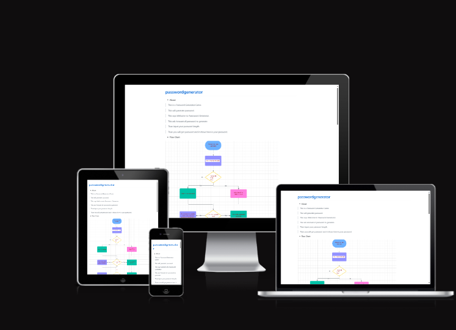
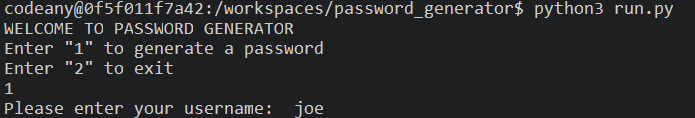

* About:
>This is password generator. It is used to Generate a password. This app asks you what type of password you need.First asking your Username and the maximum length of a password is 15 characters and asks you to Enter the excluded chars and length, then  the next step is the password. Type Enter 1 for Numerical and 2 for Alfa numerical.Then you get your password and This is a password generater.

>This is a Password Generator Game.

>This will generate password.

>This says Welcome to Paassword Generator.

>This ask Amount of password to generate.

>Than input your password length.

>Than you will get password and it shows here is your password.

* Testing:

>Testing is carried out throughout the development of the project.

>This is often done before committing the changes to the repository, where the file is kept. However, sometimes, changes are committed to the repository before rigorous testing is applied, to control changes being made.

> Testing happens immediately after and edits are made where necessary.

> I have carried out testing on the application before and post deployment and have exampled the testing I have carried out post-deployment in the documentation below. 

* Design and Inspiration

>I was inspired to make a password generator and working on a that.

>I learned so much during this course. I was intersted to work on this project.

>Below is the flowchart I created as a guide when I was first visualising how the code would be represented.

* Flow Chart:

* How To Use:
>Password Generator is a terminal based data input application. The steps are simple to follow and the user is guided through the prompts in the terminal. Through the progression of the app, the user will go through the following:

* Features:
>Please enter your username.

>Enter Password Length.
>Maximum Length is 15

 
>Enter your password length.

>password type: Enter 1 for Numerical.

>password type: Any number excluded 1,2 is Invalid.

>password type: Enter 2 for Alfa Numerical.

>Than you get password and This is generated password.

* Testing

>CI PEP8 Python Linter.

>I checked all of my Python code through the Code Institute Python Linter, which came back all clear.

 