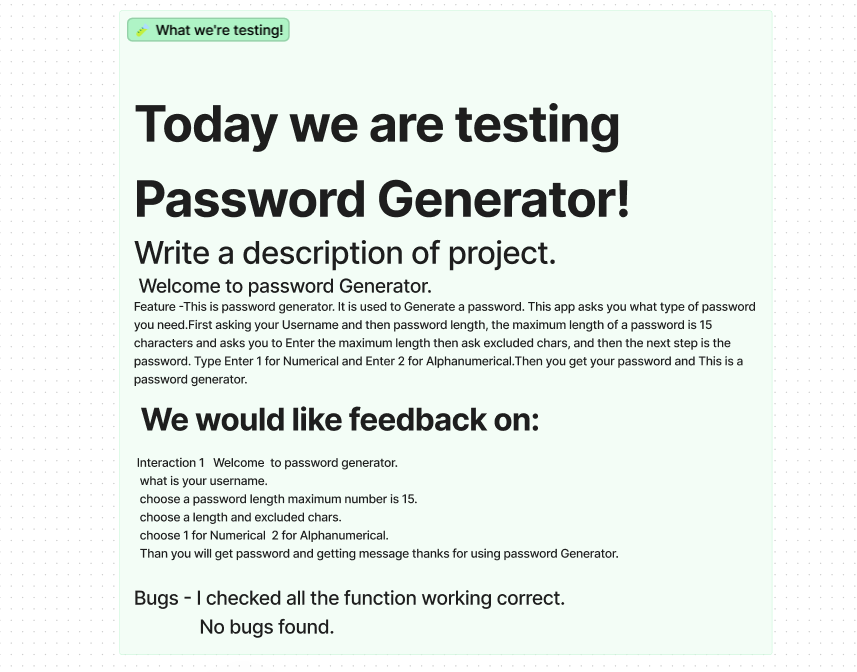
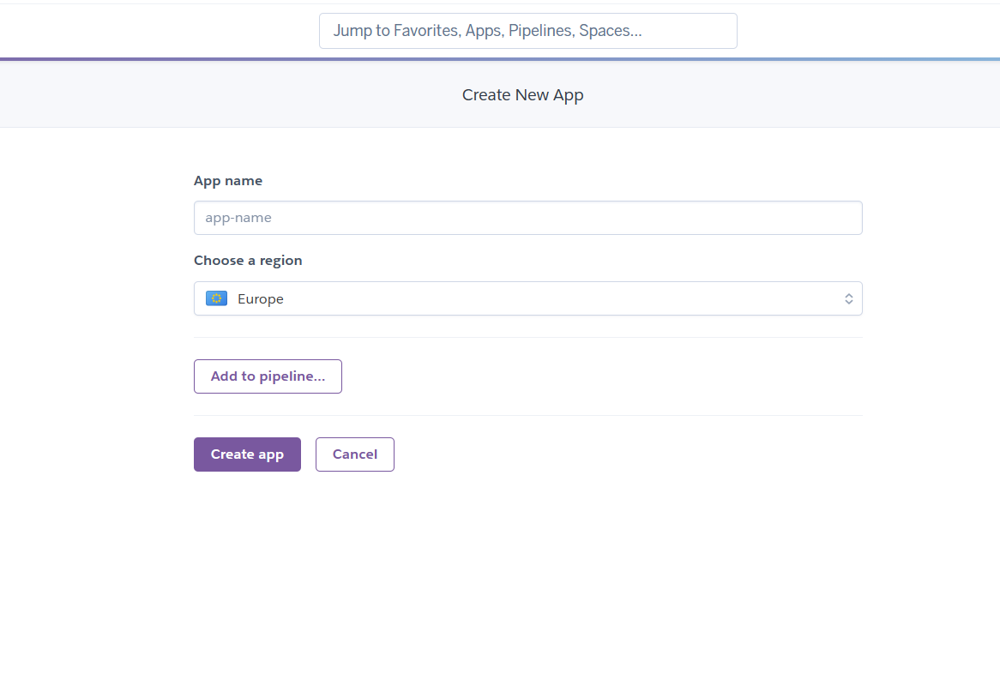
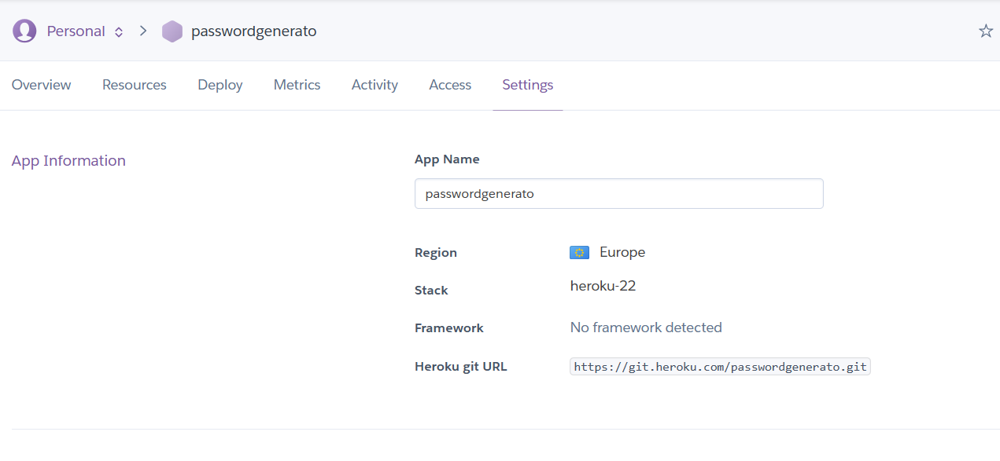
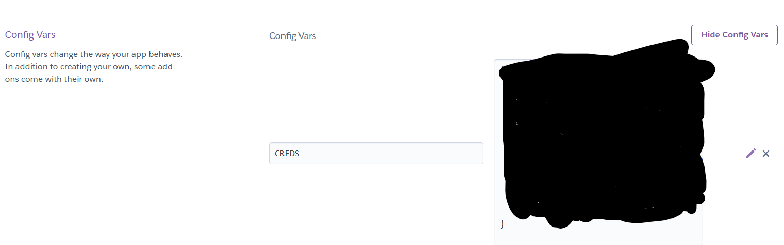

* About:
>This is password generator. It is used to Generate a password. This app asks you what type of password you need.First asking your Username and then password length, the maximum length of a password is 15 characters and asks you to Enter the maximum length then ask excluded chars, and then  the next step is the password. Type Enter 1 for Numerical and  Enter 2 for Alphanumerical.Then you get your password and This is a password generater.

>This is a Password Generator Game.

>This will generate password.

>This says Welcome to Paassword Generator.

>This ask Amount of password to generate.

>Than input your password length.

>Than you will get password and it shows here is your password.

* Testing:

>Testing is carried out throughout the development of the project.

>This is often done before committing the changes to the repository, where the file is kept. However, sometimes, changes are committed to the repository before rigorous testing is applied, to control changes being made.

>Testing happens immediately after and edits are made where necessary.

>I have carried out testing on the application before and post deployment and have exampled the testing I have carried out post-deployment in the documentation below. 
>
>
* Bugs :
>I checked all the programm is working correct no bugs found.
>All the functionalities are working correct no bugs found.
>All the screenshot attached.
* Unfixed Bugs :

>None

* Design and Inspiration

>I was inspired to make a password generator and working on a that.

>I learned so much during this course. I was intersted to work on this project.

>Below is the flowchart I created as a guide when I was first visualising how the code would be represented.

* Flow Chart:

* How To Use:
>Password Generator is a terminal based data input application. The steps are simple to follow and the user is guided through the prompts in the terminal. Through the progression of the app, the user will go through the following:

* Features:
> How to use option and images below.

>Please enter your username.

>Enter Password Length Maximum Length number is 15.

>Enter your password length.
>password type: Enter 1 for Numerical.

>password type: Any number excluded 1,2 is Invalid.

>password type: Enter 2 for Alpha Numerical.

>Than you get password and This is generated password.
* Testing
>CI PEP8 Python Linter.
>I checked all of my Python code through the Code Institute Python Linter, which came back all clear and attached screenshot.

 * Python Libraries Used and Why?

>gspread: I used gspread to access Google spreadsheets, where the data is being stored for this application. It is a library with useful data manipulation functions and allows us to access Google Sheets.But I did not put any data in spreadsheet as per as my mentor advised spreadsheet is not necessary but I attached spreadsheet and mention comment.

>google-auth: I used the Google Auth library to handle the Credentials for the API calls between the application and google sheets.

>Random: The random module in Python is a built-in module that can be used to generate pseudo-random numbers for various distributions. The module implements pseudo-random number generators for various distributions. For integers, there is uniform selection from a range.

>string: Strings are used at a larger scale i.e. for a wide areas of operations such as storing and manipulating text data, representing names, addresses, and other types of data that can be represented as text. Python has a rich set of string methods that allow you to manipulate and Drawbacks
of String in Python.

* Technologies Used :

>Python

>API

>Spreadsheet

>Figma

>AmIResponsive

>Googlesheet

>Heroku

* Requirements :

* Deployment :
>I deployed the app using the website Heroku, which hosts web-based applications. Once you have an account with Heroku, follow these steps for deployment .
>Create a new app

>Name the app

>Connect the app to GitHub and find the repository where the code is stored and click connect. 

>Go to the Settings Tab within the Heroku app. Find the Config Vars and add PORT in the key and 8000 in the value. Then for CREDS in the key and add the credentials that are copied from the .json credentials file in the IDE. I have blacked mine out, as each set of credentials is unique and private.

>Add the buildpacks in this order: Python, NodeJS.

>Add the buildpacks in this order: Python, NodeJS.
>Go back to the Deploy tab and select automatic deploys, so that whenever a new edit is received by GitHub, Heroku also updates the application. Once this has been clicked. Then click the deploy branch button at the bottom and await for the domain URL to be generated.

>We now have a deployed web application!

>Now its deployed!